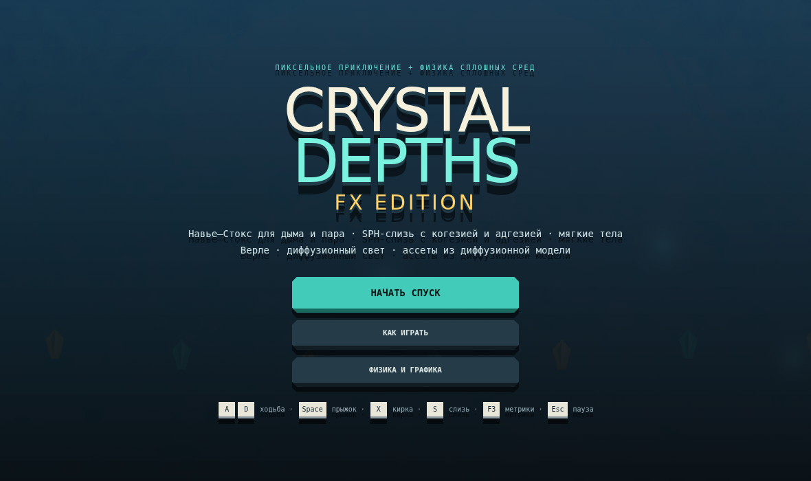
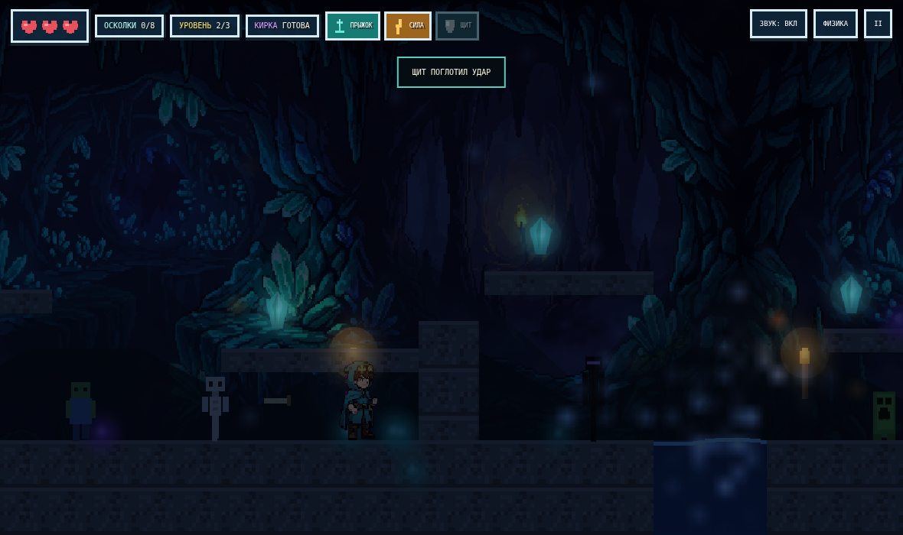
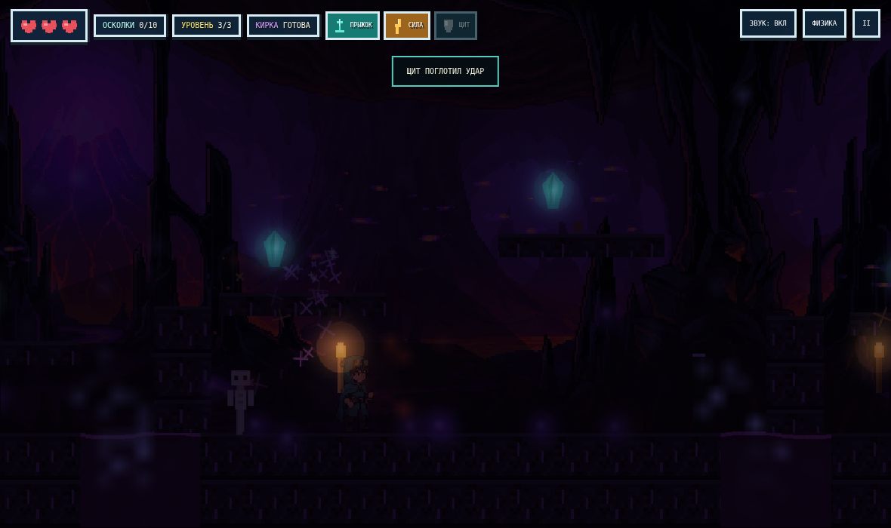

# Crystal Depths FX

Пересборка игры [GeorgiiMakarov/2D-Game](https://github.com/GeorgiiMakarov/2D-Game)
(«Crystal Depths») в модульный Vite-проект с настоящей физикой сплошных сред
поверх 2D-геймплея.

Оригинал остался оригиналом: те же три уровня, осколки, кирка, крипер/зомби/скелет/эндермен,
три силы кристаллов и портал. Сверху добавлены четыре независимых симуляции,
которые влияют и на картинку, и на геймплей.




| Навье–Стокс + диффузионный свет | Обсидиановый пик, взрыв |
| --- | --- |
|  |  |

---

## ⚠️ Важно про исходный репозиторий

Файл `2d-game.html` в репозитории **обрезан ровно на 1 048 576 байт (1 МиБ)** —
похоже, апрель загрузки через веб-интерфейс GitHub. Из 19 встроенных PNG-спрайтов
целыми остались только **3 первых кадра героя**, дальше base64-строка обрывается
посреди данных, `<script>` не закрывается и игра в браузере не запускается.
`2d-game-code.md` при этом содержит полную логику (спрайты заменены на `[PNG_SPRITE_DATA]`),
поэтому геймплей восстановлен именно из него.

Кроме того, уцелевший спрайт героя — фактически Minecraft Steve. В FX Edition он
заменён на оригинального персонажа: процедурный пиксель-арт, ноль чужого IP.

---

## Что внутри

### 1. Навье–Стокс: дым, пар, туман (`src/physics/fluid.js`)
Сеточный решатель «Stable Fluids» (Jos Stam):

```
∂u/∂t = −(u·∇)u − ∇p/ρ + ν∇²u + f,    ∇·u = 0
∂d/∂t = −(u·∇)d + κ∇²d − αd
```

* полу-лагранжева адвекция скорости и плотности;
* проекция на бездивергентное поле — уравнение Пуассона для давления, метод Гаусса–Зейделя (4–8 итераций);
* **vorticity confinement** — возвращает мелкие вихри, которые съедает численная диффузия;
* плавучесть: тёплый пар всплывает пропорционально плотности;
* препятствия-воксели: геометрия уровня переносится в маску `solid`, поэтому дым обтекает камни;
* сетка живёт в экранных координатах и сдвигается вслед за камерой.

Что это даёт в игре: пар над водой, дым факелов, лавовые вентиляции, воздух тянется
за бегущим героем, взмах кирки закручивает вихрь, взрыв крипера выбрасывает
расходящуюся ударную волну дыма, искры и пыль сносит потоком.

### 2. SPH-слизь: когезия и адгезия (`src/physics/sph.js`)
Частицы с парными силами в радиусе сглаживания h:

* давление `F_p = −k(h−d)²` — частицы не схлопываются;
* **когезия** `F_c = +k_c(h−d)` — поверхностное натяжение, капли собираются в шарики;
* вязкость — гасит относительные скорости;
* **адгезия** к стенам: вблизи поверхности `F_a = k_a(1 − d/r_a)`, при малой скорости частица
  «залипает» и медленно стекает.

Геймплей: клавиша **S** бросает слизь. Лужи тормозят и героя, и врагов; по слизи на стене
можно зацепиться и сделать прыжок от стены. Слизь увлекается воздушным потоком из п.1.

### 3. Мягкие тела Верле (`src/physics/softbody.js`, `src/game/slime.js`)
Кольцо масс с пружинами и моделью идеального газа внутри:
`F_i = P₀(V₀/V − 1)·n_i·L_i`, площадь V — по формуле шнурков, интегрирование Верле.
Из этого сделаны слизни: они прыгают, расплющиваются при приземлении, мнутся от удара киркой
и при смерти разлетаются SPH-каплями.

### 4. Диффузионный свет (`src/physics/lighting.js`)
Свет считается не лучами, а уравнением диффузии (тот же оператор, что в уравнении
теплопроводности и в forward-процессе диффузионных моделей):

```
∂L/∂t = D∇²L − σ_a L + S(x,y)
```

Источники — факелы, кристаллы, портал, лава, взрывы и фонарь героя; порода поглощает
сильнее воздуха, поэтому свет мягко обтекает выступы. Поле цветное (RGB), накапливается
между кадрами и сдвигается вместе с камерой; финальный проход — `multiply` + аддитивный bloom.

### 5. Процедурный пиксель-арт (v2: ноль чужого IP)
Герой-рудокоп Кир (`src/render/hero.js`: idle, 4 кадра ходьбы, прыжок) и весь каст врагов
(`src/render/creatures.js`: пещерный клещ, грибной ходок, каменный страж, огонёк глубин,
моховой крот) рисуются кодом попиксельно — никаких внешних спрайтов и узнаваемых чужих образов.
`public/art/*.png` — только три параллакс-фона. Тайлы, кристаллы, факелы и иконки HUD рисуются
процедурно хеш-шумом (`src/render/pixelart.js`).

---

## Запуск

```bash
npm install
npm run dev      # http://localhost:5173
npm run build    # статическая сборка в dist/
npm run preview
```

Пересобрать спрайты из сырых картинок: `python3 tools/prep_assets.py` (нужны Pillow и numpy).

## Управление

| Действие | Клавиши | Тач |
| --- | --- | --- |
| Ходьба | ← → / A D | экранные кнопки |
| Прыжок / двойной / от стены | Space / W / ↑ | ▲ |
| Кирка | X / K / J | ⛏ |
| Бросок слизи | S | S |
| Пауза | Esc / P | II |
| Метрики симуляций | F3 | — |
| Настройки физики | F2 / кнопка «ФИЗИКА» | кнопка |

## Настройки и производительность

В меню «ФИЗИКА И ГРАФИКА» каждую симуляцию можно выключить отдельно
(Навье–Стокс, vorticity, SPH-слизь, мягкие тела, диффузионный свет, bloom) и выбрать
качество ×0.6 / ×1 / ×1.5 — оно меняет шаг сеток (жидкость ~14 px, свет ~16 px при ×1),
число итераций проекции и лимит частиц. Всё сохраняется в localStorage вместе с прогрессом
(кнопка «ПРОДОЛЖИТЬ» в меню). F3 показывает FPS, время симуляций в миллисекундах,
размеры сеток и число частиц.

## Структура

```
src/
  core/       константы, ввод, процедурный звук, настройки и сохранения
  physics/    fluid.js (Навье–Стокс) · sph.js (когезия+адгезия) · softbody.js (Верле) · lighting.js (диффузия)
  game/       levels.js · slime.js · game.js (цикл, мир, герой, связь с симуляциями)
  render/     assets.js · background.js · pixelart.js · creatures.js · hero.js
public/
  art/        три параллакс-фона
tools/        prep_assets.py — legacy (каст теперь процедурный)
```

Лицензия: MIT (как и у оригинала).
